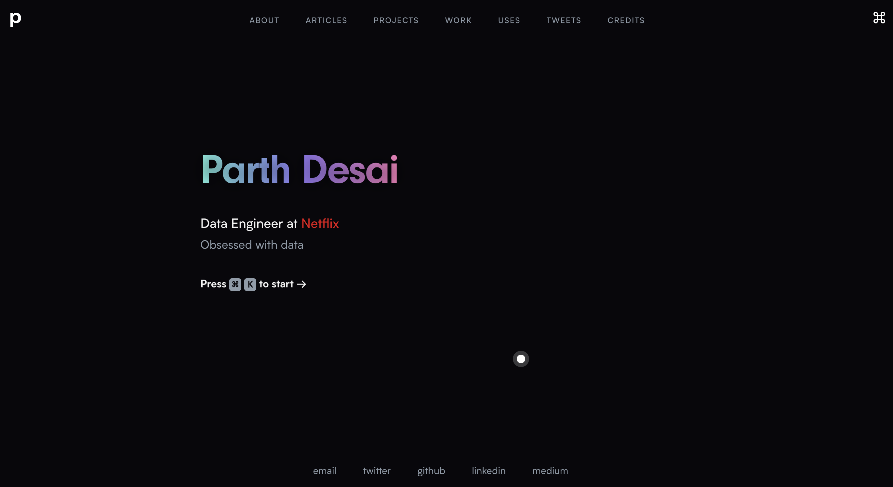
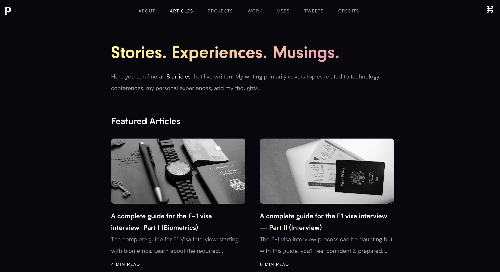
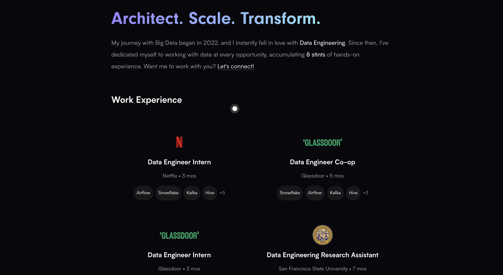

# Parth Desai's Portfolio

[](https://parthdesai.site)
[](http://parthdesai.mit-license.org/)
[](https://nextjs.org/)
[](https://stitches.dev/)
[](https://www.framer.com/motion/)

> My personal website and blog, built to showcase my work, writing, and journey as a Data Engineer.

> Forked from [Zeno Rocha's website](https://github.com/zenorocha/zenorocha.com/tree/main)

---

## 🌐 Live Demo

👉 [https://parthdesai.site](https://parthdesai.site)

---

## ✨ Features

- **Modern Design:** Clean, minimal, and responsive UI with beautiful gradients and glassmorphism.
- **Animated Interactions:** Smooth transitions and micro-interactions using Framer Motion.
- **Blog Engine:** Markdown-powered articles with syntax highlighting.
- **Project Showcase:** Dynamic project and work experience sections.
- **About Me:** Interactive bio, Lottie animations, and fun facts.
- **Uses Page:** My favorite tools, apps, and hardware.
- **SEO Optimized:** Open Graph, Twitter Cards, and structured data.
- **Dark Mode:** Eye-friendly color palette.
- **Deployed on Vercel:** Fast, global, and reliable.
- **Notion-powered Connections:** A living, ever-evolving list of people I've met or want to meet, powered by [Notion](https://desaiparth.notion.site/1e1166c4dbed80f5871ec01ee6b182a0?v=1e1166c4dbed80e68890000c5c1875e6&pvs=4) and updated regularly.
- **Command Bar:** Quick navigation and actions via a keyboard-driven command bar.
- **Mobile-First Navigation:** Hamburger menu with animated, blurred overlay for mobile users.

---

## 📸 Screenshots

| Home                                      | Blog                                                         | Work Experience                                       |
| ----------------------------------------- | ------------------------------------------------------------ | ---------------------------------------------- |
|  |  |  |

---

## 🛠️ Technology Stack

- **Styling:** [Stitches](https://stitches.dev/)
- **Content:** [Markdown](https://daringfireball.net/projects/markdown/)
- **Back-end:** [Next.js](https://nextjs.org/)
- **Front-end:** [React](https://reactjs.org/)
- **Animation:** [Framer Motion](https://www.framer.com/motion/)
- **Deployment:** [Vercel](https://vercel.com/)
- **Data/Integrations:** [Notion API](https://developers.notion.com/)

---

## 🚀 Getting Started

1. **Clone this repo:**
    ```sh
    git clone https://github.com/pycoder2000/portfolio.git
    cd portfolio
    ```

2. **Install dependencies:**
    ```sh
    npm install
    ```

3. **Run locally:**
    ```sh
    npm run dev
    ```

4. **Open in your browser:**
    ```
    http://localhost:3000
    ```

---

## 📁 File Structure

```
.
|-- articles      # Markdown blog posts
|-- components    # Reusable React components
|-- data          # Data for projects, uses, work, etc.
|-- layouts       # Page and post layouts
|-- lib           # Utilities and helpers
|-- pages         # Next.js pages
|-- public        # Static assets (images, icons, etc.)
```

---

## 🌟 Special Sections

### 🧑‍💼 Connections

A living list of inspiring people I’ve met or hope to meet—powered by a constantly updated [Notion database](https://desaiparth.notion.site/1e1166c4dbed80f5871ec01ee6b182a0?v=1e1166c4dbed80e68890000c5c1875e6&pvs=4).

- **Dynamic Cards:** Each connection is displayed as a card with name, company, title, tags, and more.
- **Filter & Search:** Instantly filter connections by name, company, or tag.
- **Animated Details:** Click a card to view more info in a modal with smooth transitions.
- **Status Tags:** See who you’ve met and who you want to meet, with colored badges.
- **Notion Integration:** Data is fetched from Notion, so your list stays up-to-date.

### 📚 Articles

- Written in Markdown, rendered with syntax highlighting.
- Table of Contents auto-generates anchor links for easy navigation.
- SEO and social sharing optimized.

### 🛠 Uses

- See [what I use](https://parthdesai.site/uses) for hardware, software, note-taking, terminal, and more.
- Each item includes a description and link.

### 🏆 Projects & Work

- Projects are grouped by year and include links, icons, and stats.
- Work experience includes highlights, technologies, and detailed descriptions.

---

## 🤝 Contributing

Contributions are welcome! If you have ideas for improvements, bug fixes, or new features:

1. Fork the repo
2. Create a new branch (`git checkout -b feature/your-feature`)
3. Commit your changes (`git commit -am 'Add new feature'`)
4. Push to the branch (`git push origin feature/your-feature`)
5. Open a Pull Request

---

## 🙋‍♂️ Author

| Socia    | Value                                                         |
| -------- | ------------------------------------------------------------- |
| Name     | Parth Desai                                                   |
| Website  | [parthdesai.site](https://parthdesai.site)                    |
| Twitter  | [@_ParthDesai_](https://x.com/_ParthDesai_)                   |
| LinkedIn | [parthdesai2000](https://www.linkedin.com/in/parthdesai2000/) |

---

## 📄 License

[MIT License](http://parthdesai.mit-license.org/) © Parth Desai

---

> _Inspired by Zeno Rocha and other amazing developers. If you like this project, feel free to star or fork!_